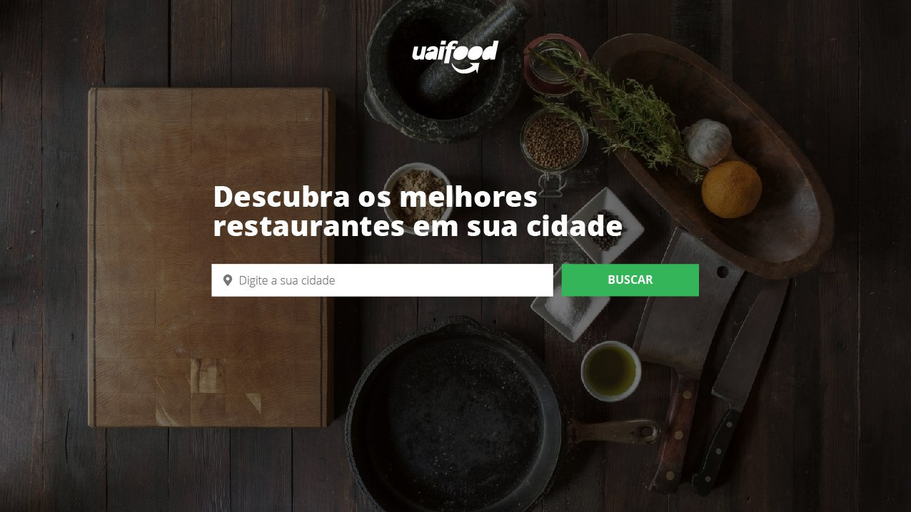
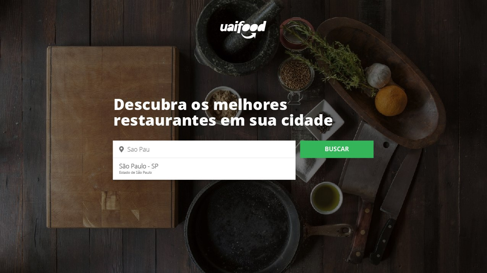
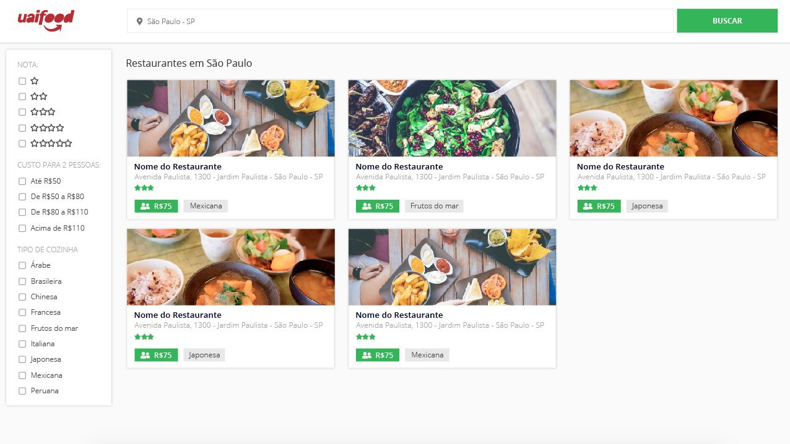

# [EVNTS] DESAFIO FRONT-END REACT

  - [1. INTRODUÇÃO](#1-introdu%C3%A7%C3%A3o)
  - [2 UAIFOOD](#2-uaifood)
    - [2.1 Telas](#21-telas)
      - [Landing](#landing)
      - [Lista de restaurantes](#lista-de-restaurantes)
    - [2.2 API](#22-api)
    - [2.3 Recursos](#23-recursos)
  - [3 BOA SORTE](#3-boa-sorte)

## 1. INTRODUÇÃO

Olá! 😁

Se você está lendo este documento você faz parte de um grupo de pessoas que acreditamos serem bons candidatos!

Fizemos este teste com muito carinho e esperamos que você consiga se sair bem 👍

O teste consiste em testar suas abilidades em construir soluções para o _Front-end_ utiliziando as tecnologias que usamos na Evnts.

Todo o seu código deve ser disponibilizado num repositório público ou privado em seu github ou bitbucket pessoal. Envie o link para o email que te enviamos (vagas@evnts.com.br).

Boa sorte!

## 2 UAIFOOD

Nós mineiros somos conhecidos pela comida (principalmente o pão de queijo) então nada mais justo do que fazer algo inovador e que nunca foi feito: __UaiFood__.

Para isso, precisamos que você crie as telas a seguir. O único requisito é utilizar a biblioteca _React_ para construir os componetes de _UI_. Fique a vontade para utilizar qualquer outra biblioteca e/ou ferramenta que achar necessário ou interessante de usar (pré-processadores css, _styled components_, e qualquer outra coisa).

### 2.1 Telas

  #### Landing

Aqui você irá mostrar apenas as possíveis cidades e permitir que o usuário escolha uma delas.
  

  
  IMG 00: Tela de pesquisa
  

  

  
  IMG 01: Tela de pesquisa com lista das cidades 
  

  #### Lista de restaurantes

Após o amiguinho selecionar a cidade, terá uma lista com todos os restaurantes daquela cidade, podendo utilizar o filtro da esquerda para filtrar os restaurantes por nota, custo e tipo de cozinha:

  
  IMG 01: Tela de pesquisa com lista das cidades 
  

### 2.2 API

Para dar vida ao site utilize a [API](https://developers.zomato.com/api?lang=pt) do [Zomato](https://www.zomato.com/pt/sao-paulo-sp) para pegar todas as informações necessárias para as duas páginas.

### 2.3 Recursos

Todas as imagens que precisará utilizar estão dentro deste repositório em [imgs](/imgs).

Os ícones são todos do [font-awesome](https://fontawesome.com/):
  - [Pin mapa](https://fontawesome.com/icons?d=gallery&q=f3c5) (solid)
  - [Estrela contorno](https://fontawesome.com/icons?d=gallery&q=f005) (regular)
  - [Estrela full](https://fontawesome.com/icons?d=gallery&q=f005) (solid)
  - [Duas pessoas](https://fontawesome.com/icons?d=gallery&q=f500) (solid)

Fonte: [Open Sans](https://fonts.google.com/specimen/Open+Sans)

<!-- ## 3 Desafios Extras

Se você é bão/dedicado e já terminou o __UaiFood__, meus parabéns!
Você é foda! ❤️ 

Utilize qualquer ferramenta de deploy para deixar seu site funfando na internet. Nos mande o link e uma breve explicação do qual ferramenta utilizou, como fez e etc.

Implemente mais algumas dessas coisas e ganhe pontos extras com a gente: 
 -->

## 3 BOA SORTE

Mandavê 😘